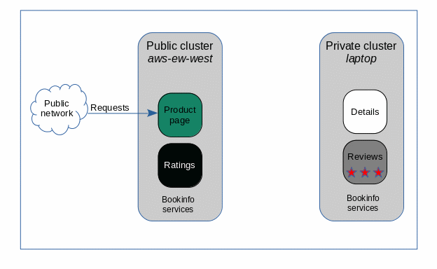
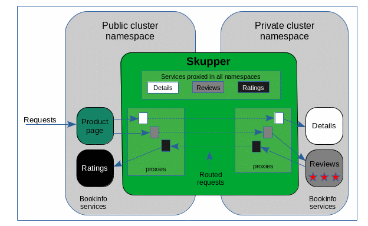

# Distributing Bookinfo Web Services across Kubernetes Clusters with Skupper

This tutorial demonstrates how to distribute 
[Istio Bookinfo Application](https://istio.io/docs/examples/bookinfo/)
web microservices application between public and private cluster project
namespaces. The application requires no special coding to adapt to
the distributed environment. With Skupper it 
behaves as if all the services are running in the same cluster namespace.

This example further illustrates how services in a
public cluster access services in a private cluster when the private cluster 
has no ingress routes and
will not accept incoming network connections. 
The Skupper infrastructure securely provides this connectivity
without special user permissions, firewall rules, VPNs, sidecars, or system administrator
actions.

In this tutorial you will deploy 
the _productpage_ and _ratings_ services on a remote, public cluster
in namespace `bookinfo-pub`
and
the _details_ and _reviews_ services in a local, on-premises cluster in namespace `bookinfo-pvt`.

A video of this demo is available at [https://youtu.be/MO12bk_nczM](https://youtu.be/MO12bk_nczM).

### Bookinfo Skupper Deployment



User access to the application is via an ingress route to the _productpage_ service.
The remaining services are not publicly accessible but are available to
the _productpage_ and to each other through the Skupper network.

In the Bookinfo application the _productpage_ service sends requests to the
_details_ and _reviews_ services, and the _reviews_ service sends requests
to the _ratings_ service. Skupper manages routing the requests between
the services regardless of the cloud instance or namespace in which the services
are running.

### Bookinfo Skupper Deployment Details



This illustration shows how Skupper manages to get service requests across the
Skupper network. Skupper is a distributed system with installations running
in one or more namespaces. As Skupper installations are connected they share
information about what services each installation exposes. All Skupper installations learn 
about which
services are exposed on every other installation. Skupper then runs proxy service endpoints
in each namespace to properly route requests to or from every exposed service.

* In the Public namespace the _details_ and _reviews_ proxies intercept requests for their 
services and forward them to the Skupper
network. In the Private namespace the _details_ and _reviews_ proxies receive requests from the
Skupper network and send them to the related service. 

* In the Private namespace the _ratings_ proxy intercepts requests for its service and 
forwards them to the Skupper network. In the Public namespace the _ratings_ 
proxy receives requests from the Skupper network and sends them to the related service.

### Credits

This demo uses public Bookinfo images provided by _docker.io/maistra_. The _maistra_ images
constrain filesystem access to common directories and provide a
successful demo on a wider variety of Kubernetes platforms.

## Run the Bookinfo tutorial

To complete this tutorial, do the following:

* [Prerequisites](#prerequisites)
* [Step 1: Set up your namespaces](#step-1-set-up-your-namespaces)
* [Step 2: Install demo source files](#step-2-install-demo-source-files)
* [Step 3: Deploy Bookinfo application](#step-3-deploy-bookinfo-application)
* [Step 4: Expose productpage service](#step-4-expose-productpage-service)
* [Step 5: Install Skupper](#step-5-install-skupper)
* [Step 6: Connect your Skupper installations](#step-6-connect-your-skupper-installations)
* [Step 7: Virtualize your internal services via Skupper](#step-7-virtualize-your-internal-services-via-skupper)
* [Step 8: Open Bookinfo application](#step-8-open-bookinfo-application)
* [Next steps](#next-steps)


## Prerequisites

* The `kubectl` command-line tool, version 1.15 or later ([installation guide](https://kubernetes.io/docs/tasks/tools/install-kubectl/))
* The `skupper` command-line tool, the latest version ([installation guide](https://skupper.io/start/index.html#step-1-install-the-skupper-command-line-tool-in-your-environment))
* Two Kubernetes namespaces, from any providers you choose, on any clusters you choose

## Step 1: Set up your namespaces

Since we are dealing with two namespaces, we need to set up isolated
`kubectl` configurations, one for each namespace.  In this example, we
will use distinct kubeconfigs on separate consoles.

Console for namespace `bookinfo-pvt`:

    export KUBECONFIG=$HOME/.kube/config-pvt
    <login-command-for-your-provider>
    kubectl create namespace bookinfo-pvt
    kubectl config set-context --current --namespace bookinfo-pvt

Console for namespace `bookinfo-pub`:

    export KUBECONFIG=$HOME/.kube/config-pub
    <login-command-for-your-provider>
    kubectl create namespace bookinfo-pub
    kubectl config set-context --current --namespace bookinfo-pub

See [Getting started with Skupper](https://skupper.io/start/) for more
information about setting up namespaces.

## Step 2: Install demo source files

Make a directory for this tutorial and clone the example repo into it. 

    mkdir bookinfo-demo
    cd bookinfo-demo
    git clone https://github.com/skupperproject/skupper-example-bookinfo.git
    cd skupper-example-bookinfo

This step must be repeated on each system running the cluster consoles.

## Step 3: Deploy Bookinfo application

This step creates a service and a deployment for each of the four Bookinfo microservices.

Console for namespace `bookinfo-pub`:

    $ kubectl apply -f public-cloud.yaml
    service/productpage created
    deployment.extensions/productpage-v1 created
    service/ratings created
    deployment.extensions/ratings-v1 created

Console for namespace `bookinfo-pvt`:

    $ kubectl apply -f private-cloud.yaml 
    service/details created
    deployment.extensions/details-v1 created
    service/reviews created
    deployment.extensions/reviews-v3 created

## Step 4: Expose productpage service

Console for namespace `bookinfo-pub`:

    kubectl expose deployment/productpage-v1 --port 9080 --type LoadBalancer

The Bookinfo application is accessed through an ingress port to the _productpage_ service.

The productpage may be accessed but the page will show errors since the back end services are not yet available.
Let's fix that now.

## Step 5: Install Skupper

Console for namespace `bookinfo-pvt`:

    skupper init

Console for namespace `bookinfo-pub`:

    skupper init

Use `skupper status` in each console to check that Skupper is
installed.

    $ skupper status
    Namespace '<ns>' is ready.  It is connected to 0 other namespaces.

As you move through the steps that follow, you can use `skupper
status` at any time to check your progress.

## Step 6: Connect your Skupper installations

After installing Skupper you have the infrastructure you need but your namespaces 
are not connected. You need to connect your Skupper installations.

The ```skupper connection-token``` command generates a secret token that signifies permission 
to connect to this namespace. The token also carries the network connection details so
that a connecting Skupper namespace can find originating namespace. 

The ```skupper connect``` command uses the connection token to establish a connection to the 
namespace that generated it.

### Generate a connection token

Console for namespace `bookinfo-pub`:
 
    skupper connection-token PVT-to-PUB-connection-token.yaml

### Use the token to form a connection

Console for namespace `bookinfo-pvt`:

    skupper connect PVT-to-PUB-connection-token.yaml

If your console sessions are on different machines, you may need to
use `scp` or a similar tool to transfer the token to the system
hosting the `bookinfo-pvt` console.

### Check the connection

Console for namespace `bookinfo-pub`:

    $ skupper status
    Skupper enabled for "bookinfo-pub". It is connected to 1 other sites.

Console for namespace `bookinfo-pvt`:

    $ skupper status
    Skupper enabled for "bookinfo-pvt". It is connected to 1 other sites.

## Step 7: Virtualize your internal services via Skupper

You now have a Skupper network capable of multi-cluster communication 
but no services are yet associated with it. This step uses the ```kubectl annotate``` 
command to notify Skupper that a service is to be included in the Skupper network.

Console for namespace `bookinfo-pub`:

    $ kubectl annotate service ratings skupper.io/proxy=http
    service/ratings annotated

Console for namespace `bookinfo-pvt`:

    $ kubectl annotate service details skupper.io/proxy=http
    service/details annotated
    
    $ kubectl annotate service reviews skupper.io/proxy=http
    service/reviews annotated

Upon observing an annotation, Skupper virtualizes the annotated service to
the Skupper network. Skupper proxies are created to route requests between
the virtual services and the actual annotated service deployment instance.

Skupper makes the annotated services available to every namespace in the Skupper
network. Now the Bookinfo application will work because the productpage service
on the public cluster has access to the _details_ and _reviews_ services on
the private cluster and because the _reviews_ service on the private cluster
has access to the _ratings_ service on the public cluster.

## Step 8: Open Bookinfo application

The web address for the Bookinfo app can be discovered from 
the console for namespace `bookinfo-pub` cluster: 

    $ echo $(kubectl get service/productpage -o jsonpath='http://{.status.loadBalancer.ingress[0].hostname}:9080')

Open the address in a web browser.

## Next steps

